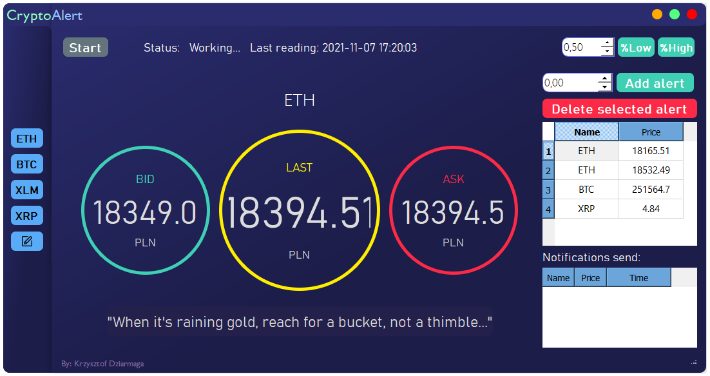

# Crypto_notify app

Application made using Python and PySide2 framework. 

It communicates with BitBay Exchange through rest API to check prices of cryptocurrencies and send notofication when the target price is met.
It allows user to set many alerts of multiple cryptocurrencies at the same time. GUI of the program is shown below:

## SETUP
1. Install modules used in project by command: "python -m pip install -r requirements.txt"
2. Fill in the 'Settings.txt' file
3. Run program from command line using: "python Crypto_notifications.py"